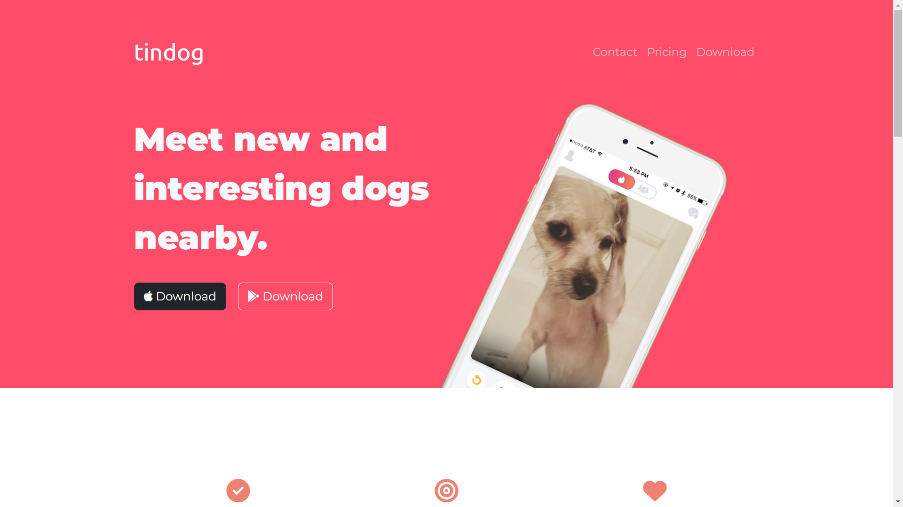

# TinDog
TinDog
TinDog is a modern and fun web application that lets dogs find their perfect match. It is a parody of the popular dating app, Tinder, made exclusively for dogs.

# Features
User-friendly interface designed for dogs and their owners

Fully responsive design for use on desktop and mobile devices

# Technologies
TinDog is built using the following technologies:

HTML and CSS for the frontend
Bootstrap framework for responsive design and UI components

# How to Use
To use TinDog, simply go to the index.html and enjoy reading the content. You will find information about the features of the app, the technology used to build it, how to use it, and how to contribute to the project.

# Acknowledgements
TinDog was inspired by the popular dating app, Tinder, and is built using a variety of web technologies.
